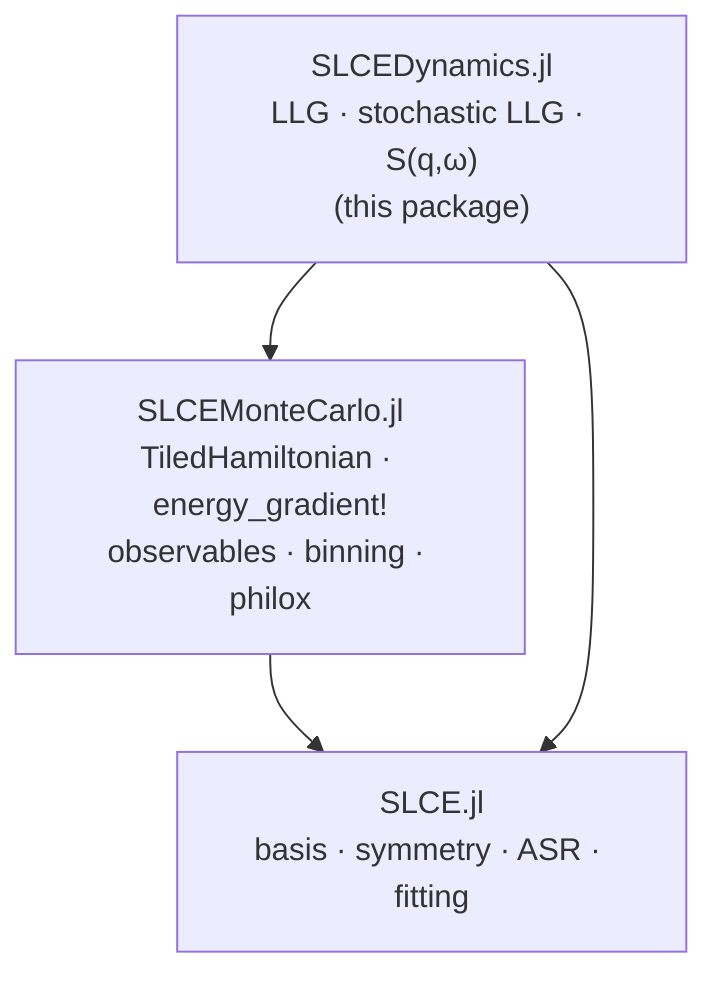
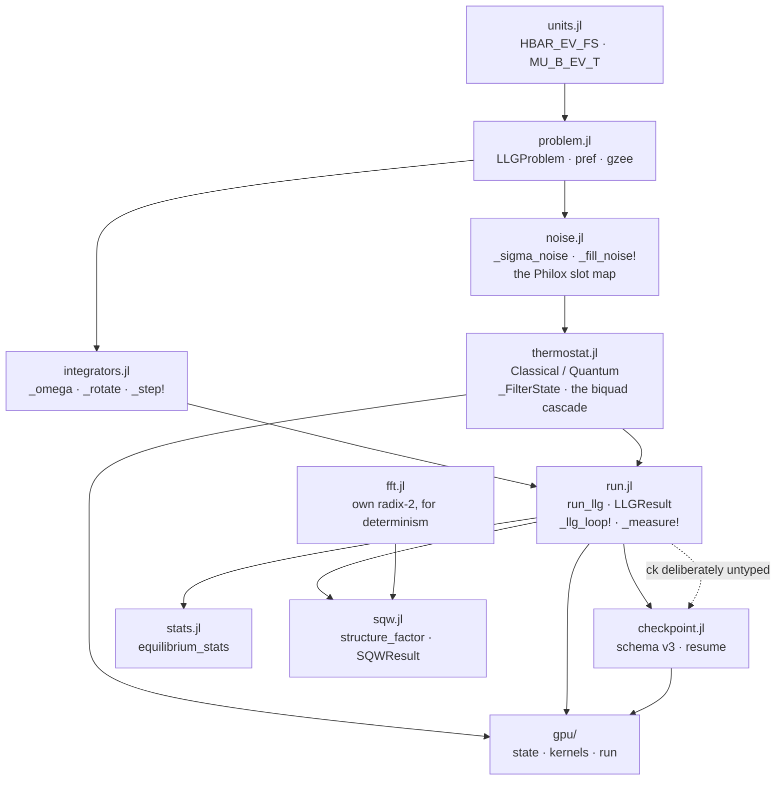

# Architecture and reading order — SLCEDynamics.jl

This file answers one question: **coming back to this code, what do I read, in what
order, and how do the pieces depend on each other?**

Neighbours that cover the rest:

| For | Read |
|---|---|
| The working equation, units, validation pyramid, public API | [`SPEC.md`](SPEC.md) |
| Which files must change together, and the gate that proves it | [`CLAUDE.md`](CLAUDE.md) § "Coupled code sites" |
| Why the thermostat and the GPU port are shaped the way they are | [`docs/specs/quantum-thermostat.md`](docs/specs/quantum-thermostat.md), [`docs/specs/gpu-llg.md`](docs/specs/gpu-llg.md) |
| Naming | [`STYLE_GUIDE.md`](STYLE_GUIDE.md) |
| The family-wide data flow | [`../SLCE.jl/ARCHITECTURE.md`](../SLCE.jl/ARCHITECTURE.md) § 5 |

---

## 1. Where this package sits



An arrow **A → B** reads "A depends on B". This is the leaf of the family: nothing
depends on it.

**From SLCEMonteCarlo** it takes the whole energy layer rather than re-deriving it:
`TiledHamiltonian`, `energy_gradient!` (tangent-projected, exact, bit-identical for
any task count), `MCView` / `Observable` / `Evaluable`, `LogBinner` and the
jackknife, `philox_block` / `philox_normal2`, `model_fingerprint`, `n_sites`,
`site_active`. **From SLCE** only `Crystal`, `n_atoms`, `resolve_kt`.

That borrowing is the design: one `Observable` definition measures identical values
in an MC run and an LLG run, and one RNG contract makes both reproducible.

**Third-party**: `JLD2` (checkpoint schema v3), `KernelAbstractions` (device LLG
stages — **no CUDA dependency in the package**; CUDA lives only in the tracked
`bench/Project.toml`), StaticArrays / LinearAlgebra / Statistics.

---

## 2. Internal layering

Include order in `src/SLCEDynamics.jl`:

```
units.jl · problem.jl · integrators.jl · noise.jl · thermostat.jl
run.jl · checkpoint.jl · stats.jl · fft.jl · sqw.jl
gpu/{state, kernels, run}.jl
```



### Include positions that are load-bearing

- `integrators.jl` and `thermostat.jl` before `run.jl` — `_RunSpec` annotates
  `::AbstractIntegrator` and `::AbstractThermostat`, and `run.jl` also *interpolates*
  a thermostat constant into a docstring, which is resolved at parse time.
- `noise.jl` before `thermostat.jl` — the quantum path claims Philox slots relative
  to the classical domain tag defined there.
- `thermostat.jl` before `gpu/state.jl` — the biquad type appears in a type-parameter
  bound.

### The one upward call

`run.jl` calls the checkpoint helpers, which are included after it. Sound only
because the checkpointer argument is left unannotated, and that is documented at the
call site.

---

## 3. Reading order

About an hour, assuming SLCEMonteCarlo's energy layer is already familiar.

| # | File | What it establishes | Key names |
|---|---|---|---|
| 1 | `src/SLCEDynamics.jl` | The working equation, the unit system, the torque convention; the `using` block is the complete borrow list | — |
| 2 | `src/problem.jl` | The immutable per-run object, and the single place μ_B and ħ enter | `LLGProblem`, `pref`, `gzee` |
| 3 | `src/integrators.jl` | The equation of motion in rotation-vector form — this is the physics | `_omega`, `_rotate`, `_step!` |
| 4 | `src/noise.jl` | The entire stochastic contract in under seventy lines: the FDT amplitude, one draw per step (Stratonovich), and the counter layout | `_sigma_noise`, `_fill_noise!`, `_noise_ctrs` |
| 5 | `src/run.jl` | The driver, the result container, and the absolute-step purity that resume depends on | `run_llg`, `LLGResult`, `_llg_loop!`, `_measure!` |
| 6 | `src/thermostat.jl` | The quantum thermostat. On a first pass read only the filter resolution and the noise fill; the pinned coefficient table is fitted offline | `AbstractThermostat`, `_FilterState`, `_fill_noise_quantum!` |
| 7 | `src/sqw.jl` | The measurement product. The estimator is fully specified in the file header — read that before the code | `trajectory_observable`, `SQWResult`, `structure_factor` |

### Safe to skip on a first pass

- `src/gpu/{state,kernels,run}.jl` — a *literal* device mirror; the kernels are
  line-for-line ports of `noise.jl`, the thermostat cascade and the integrator
  stages. The only genuinely new content is the backend/workgroupsize determinism
  clause.
- `src/checkpoint.jl` — JLD2 plumbing. What matters is stated in `run.jl`: every
  per-step effect is a pure function of the absolute step index.
- `src/fft.jl` — textbook radix-2, present for determinism rather than speed, and
  gated against a reference DFT.
- `src/stats.jl` — a thin adapter onto SLCEMonteCarlo's binner and jackknife.
- The pinned biquad coefficient table in `thermostat.jl` — fitted offline by
  `dev/fit_qtb_filter.jl`.

---

## 4. Entry points and where the work happens

```
run_llg(problem, integrator; …)        run.jl
 ├─ resolve_kt                         SLCE — temperature[K] XOR kT[eV]
 ├─ _resolve_quantum_fstate            thermostat.jl → _build_quantum_filter
 └─ _llg_loop!                         run.jl
      ├─ _fill_noise!                  noise.jl → philox_normal2  (SLCEMonteCarlo)
      │  or _fill_noise_quantum!       thermostat.jl → _qt_cascade!
      ├─ _step!                        integrators.jl
      │    ├─ energy_gradient!         SLCEMonteCarlo — the borrowed energy layer
      │    └─ _omega / _rotate
      └─ _measure!                     builds an MCView with an EMPTY disps

equilibrium_stats                      stats.jl → LogBinner / jackknife (SLCEMonteCarlo)
structure_factor(result, H, crystal, qs)
                                       sqw.jl → _sqw_chunk! → _fill_phases! → _fft_pow2!
gpu_run_llg                            gpu/run.jl → _llg_loop_gpu! → _gpu_step!
resume                                 checkpoint.jl (CPU) / gpu/run.jl (device)
```

Three things worth remembering rather than re-deriving:

- **The same noise draw feeds both integrator stages** (Stratonovich). `_fill_noise!`
  runs once per step, never per stage.
- **The classical mode is byte-compatible with the quantum one turned off**: the
  quantum cascade shares the classical draws and claims separate slots for its
  stationary initialisation, so switching the thermostat off reproduces old
  trajectories bit for bit.
- **A run is a fixed-cell run.** The `MCView` this package builds carries an empty
  displacement channel and no cell scale, so a displacement or strain observable
  correctly throws here instead of silently reporting zeros.
